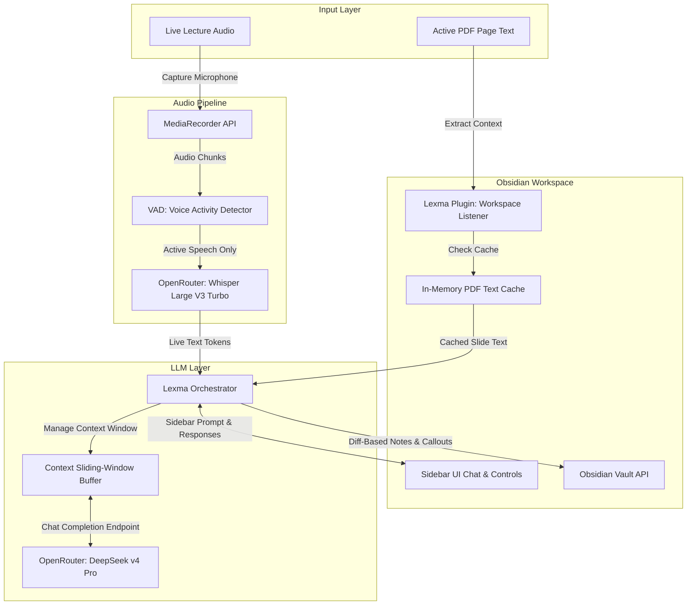
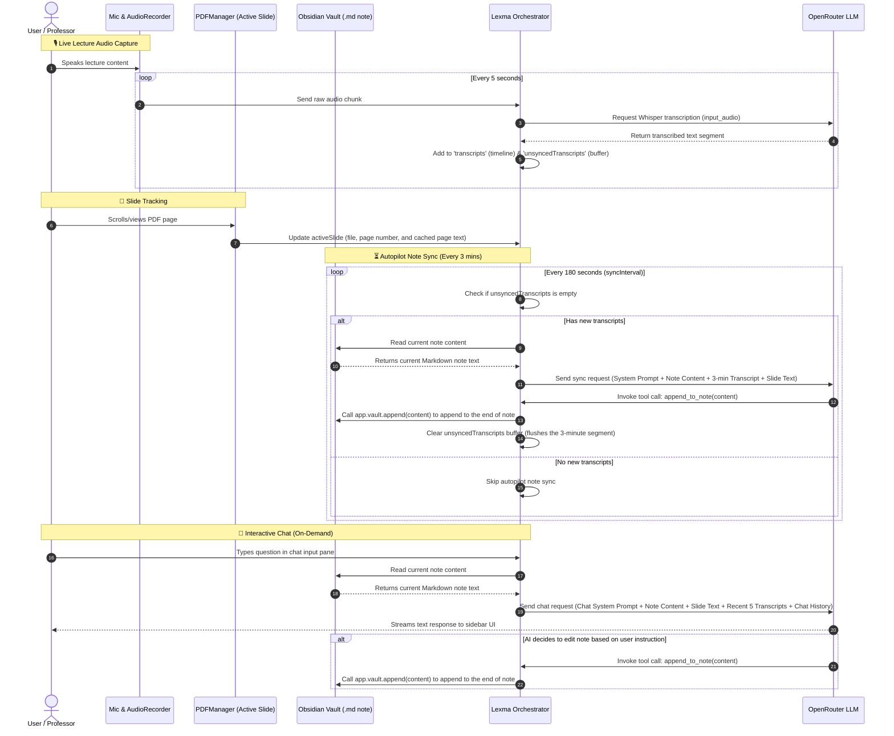

# Lexma: Real-Time Lecture Co-Pilot for Obsidian

Lexma is a real-time lecture co-pilot extension for Obsidian. It captures live lecture audio, transcribes it on the fly, and fuses it with the context of your active PDF slide to automatically generate structured notes, collapsible Q&A callouts, and visual mindmaps (Mermaid diagrams)—all within a sandboxed, cost-optimized workspace.

---

## 🗺️ System Architecture



### 🔄 Context Injection & Sync Flow



---

## ✨ Core Features

*   🎙️ **Live Transcription Co-Pilot:** Captures microphone or system audio and streams it to OpenRouter's Whisper API, showing a rolling transcript buffer.
*   🔄 **Contextual Slide Fusion:** Tracks the active PDF view and page index, combining slide text with spoken concepts to dynamically update notes in the background.
*   📊 **Real-Time Asset Creation:** Automatically formats Markdown structures, generates collapsible exam prep Q&As (`> [!faq]`), and draws structural flowcharts (Mermaid diagrams) as the lecture progresses.
*   💬 **Interactive Sidebar Chat:** A chat window in the sidebar that allows you to converse with the agent regarding the lecture and active slides.
*   💰 **Cost-Minimization Engine:** Features local Voice Activity Detection (VAD) to skip silent recordings, and a sliding-window context buffer that reduces LLM token consumption to ~1,100 tokens per query.
*   📱 **Cross-Device Ready:** Built entirely using HTML5 Web APIs and Obsidian's abstraction layers. Fully compatible with Desktop, Tablets (iPadOS/Android), and Mobile.

---

## 📁 Repository Structure

*   `src/main.ts`: Plugin entry point, registering views, settings, commands, and hooks.
*   `src/settings.ts`: Local Settings UI (API keys, VAD settings, context budgets).
*   `src/views/SidebarView.ts`: Responsive sidebar UI view.
*   `src/services/`: Services for audio captures, OpenRouter calls, PDF managers, and orchestration.
*   `src/tools/`: Safe, sandboxed folder manipulation tool contracts.
*   `plan_architecture.md`: Detailed engineering blueprints, safety sandboxes, and pricing calculations.

---

## 🚀 Getting Started

### Prerequisites
- [Node.js](https://nodejs.org/) (version 18 or higher recommended)
- [Obsidian](https://obsidian.md/) installed for testing

### Setup and Development
1. Clone this repository:
   ```bash
   git clone https://github.com/AmmarAlasad/lexma.git
   ```
2. Install dependencies:
   ```bash
   npm install
   ```
3. Run the development server in watch mode:
   ```bash
   npm run dev
   ```
   *This starts esbuild in watch mode. Any changes you make under `src/` will automatically compile into `main.js`.*

---

## 🛠️ Testing Locally

1. Create a directory named `lexma` under your Obsidian Vault's plugin directory:
   `/path/to/your/vault/.obsidian/plugins/lexma/`
2. Copy `main.js`, `manifest.json`, and `styles.css` directly to that folder (or set up a symbolic link).
3. Open Obsidian, go to **Settings** -> **Community plugins**, turn on Community plugins, and enable **Lexma**.

---

## 📄 License

This project is licensed under the Apache License, Version 2.0. See the [LICENSE](LICENSE) file for details.
