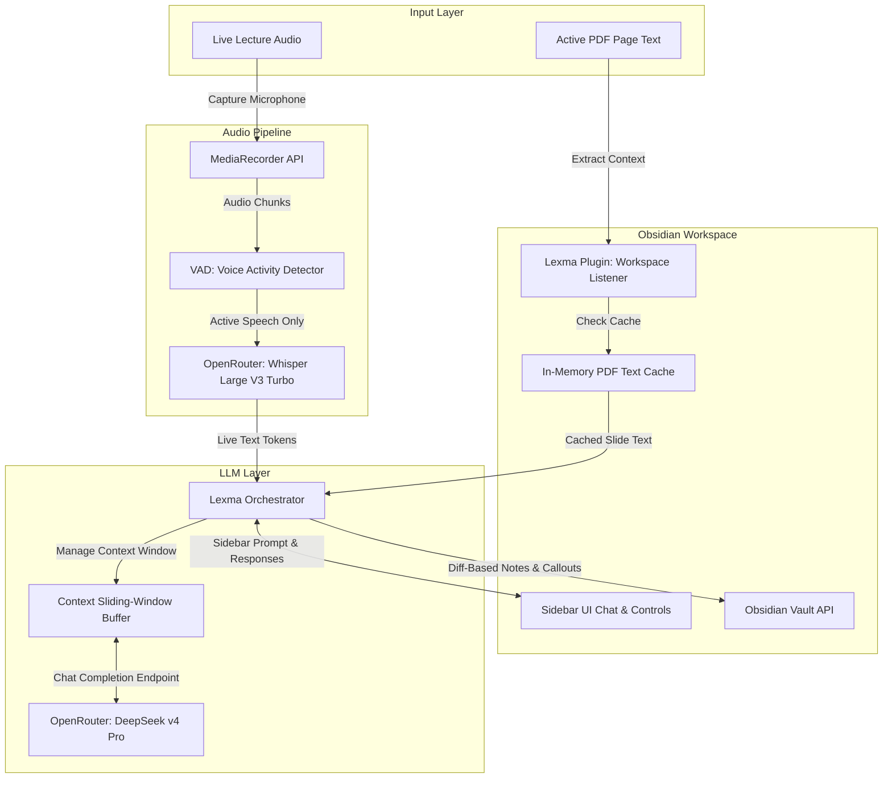
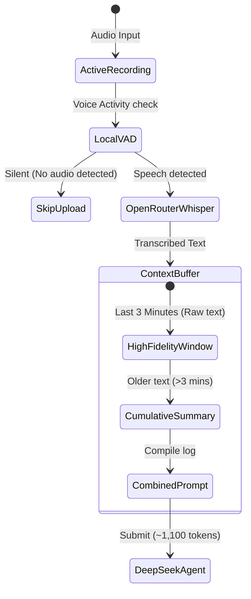
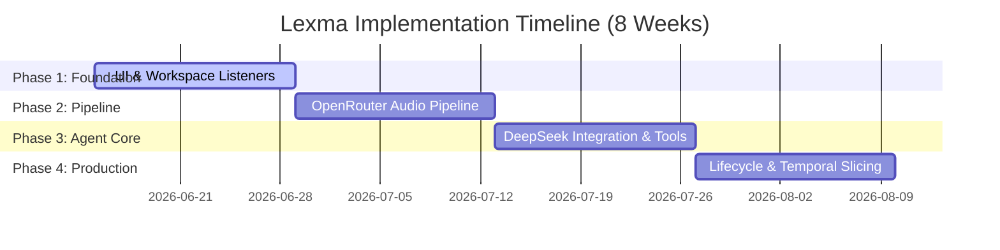

# Lexma Obsidian Extension: Plan & Architecture

This document outlines the detailed system architecture, file/directory structures, agent tools, safety guardrails, cost-estimation metrics, and multi-phase implementation plan for the **Lexma** Obsidian extension. 

---

## 🗺️ System Architecture & Data Flow



---

## 🧠 1. AI Component Breakdown

Lexma divides its processing workload between two specialized models integrated via **OpenRouter**:

### A. The Transcription Layer
* **Model:** `openai/whisper-large-v3-turbo`
* **Responsibility:** Captures continuous audio streams, filters out room noise, and outputs clean, timestamped text tokens.
* **Execution:** Audio payloads are chunked (5-10 second fragments) via the browser's `MediaRecorder` API and forwarded to OpenRouter.

### B. The Reasoning & Synthesis Layer
* **Model:** `deepseek/deepseek-v4-pro` (The Lexma Agent)
* **Responsibility:** Acts as the brain. Synthesizes rolling speech transcripts with the text/visual layout of the active PDF slide to generate background notes and handle questions.

---

## ⚙️ 2. Cost Minimization & Context Window Management

To ensure high performance and lower API consumption costs, Lexma implements several caching and structural formatting strategies:



### A. Sliding-Window Context Compression
* **The Problem:** A 1-hour lecture contains thousands of spoken words, translating to 10,000+ tokens. Sending the entire transcript on every user prompt or background update causes quadratic cost scaling and quickly exhausts mobile/tablet memory and context limits.
* **The Solution:**
  1. **Moving Window:** Keep a rolling buffer of the last **3 minutes of raw, high-fidelity transcript** (approx. 600 tokens) to capture immediate local context.
  2. **Cumulative Summary:** Summarize transcript content older than 3 minutes into a bulleted, highly compressed log (approx. 200 tokens).
  3. **Resulting Prompt:** The prompt sent to the LLM always maintains a static budget: `Cumulative Summary` (200 tokens) + `Recent Transcript` (600 tokens) + `Active PDF Slide Text` (300 tokens) = **~1,100 tokens total**, regardless of lecture length.

### B. In-Memory PDF Page Text Caching
Text is extracted *once* per page using standard `pdf.js` whenever a page change is detected. This text is cached in a key-value store map (`Map<string, string>`) indexed by `filePath + "_" + pageNumber`. Subsequent updates read instantly from memory, eliminating overhead on the main JavaScript thread.

### C. Local Voice Activity Detection (VAD)
Implement a simple Web Audio API analyser node to measure the decibel threshold in the microphone buffer. Audio slices are only uploaded to OpenRouter's Whisper API if voice activity is detected, saving transcription costs during silences.

### D. Diff-Based Vault Modifiers
Instead of the agent rewriting the entire note file whenever an update occurs, the orchestrator issues append-only writes or performs targeted line replacements. This minimizes output token sizes, which are billed at a premium rate.

---

## 📦 3. Directory & File Structure Plan

```
lexma/
├── src/
│   ├── main.ts                   # Entry point, registers views, settings, commands, hooks
│   ├── settings.ts               # Local Settings UI (OpenRouter Key, VAD threshold, sliding window config)
│   ├── types.ts                  # Shared interfaces (SessionState, Message, SlideContext, etc.)
│   ├── views/
│   │   └── SidebarView.ts        # Sidebar leaf UI (chat window, session toggle, waveforms, status logs)
│   ├── services/
│   │   ├── AudioRecorder.ts      # Browser audio captures, slicing, and Web Audio API VAD logic
│   │   ├── OpenRouterClient.ts   # Connects to OpenRouter for STT and streaming DeepSeek API calls
│   │   ├── PDFManager.ts         # Workspace PDF leaf tracker, extracts text and caches active slide pages
│   │   └── Orchestrator.ts       # Orchestrates rolling transcript buffers, sliding context window, and updates vault notes
│   └── tools/
│       └── VaultSandboxTools.ts  # Declares safe actions available for the agent's function-calling
├── styles.css                    # CSS file for sidebar layouts, custom scrollbars, callout formatting
├── manifest.json                 # Extension metadata
├── tsconfig.json                 # TypeScript rules
└── esbuild.config.mjs            # Production and Development compiler config
```

---

## 🛠️ 4. AI Agent Toolset Specification

The DeepSeek model will have access to the following JSON schema function-calling tools:

1. `read_active_note()`
   - **Parameters:** none
   - **Description:** Reads the markdown note file associated with the active recording session.
2. `write_note_append(content: string)`
   - **Parameters:** `content: string` (the markdown formatted string to add)
   - **Description:** Appends markdown content (such as summarized points, callout blocks, or Mermaid charts) to the end of the active note.
3. `modify_note_regex(targetPattern: string, replacementContent: string)`
   - **Parameters:** `targetPattern: string` (regex pattern to locate), `replacementContent: string` (new text)
   - **Description:** Modifies specific lines in the active note matching a specific pattern (e.g. updating an existing header or table row) to avoid rewriting the full document.
4. `read_past_transcript()`
   - **Parameters:** none
   - **Description:** Retrieves the full cached text log of the current lecture transcription if the student asks for something outside the 3-minute sliding window.

---

## 🛡️ 5. Safety Guardrails

All tool calls are validated inside `VaultSandboxTools.ts` before execution to guarantee safety:

1. **Directory Restriction (Sandbox Lock)**:
   - The LLM can only read/write files under the dedicated project vault directory designated for the current lecture session (e.g., `Vault/LexmaSessions/Session_YYYY-MM-DD/`).
   - Any path argument containing `..` or targeting a file outside this path is instantly blocked with a sandbox error code sent back to the LLM.
2. **File Extension Lock**:
   - The LLM can only modify `.md` files. File actions targeting `.pdf`, `.png`, or system configurations (`.json`, `.js`) are strictly rejected.
3. **Mermaid.js Syntax Validator**:
   - Before injecting a generated Mermaid code block (` ```mermaid ... ``` `) into the note, the plugin parses the string against a lightweight client-side validator or regex parser. If the syntax is broken (e.g. unquoted labels containing brackets), the action is blocked or cleaned up automatically to prevent rendering errors.
4. **App teardown (`onunload`) Guarantee**:
   - The audio pipeline hooks into the native Electron/browser unload events. If the user quits, the plugin forcefully releases mic streams, flushes remaining base64 tokens, writes a "session saved" footer, and cleans up memory objects.

---

## 📱 6. Cross-Device Compatibility & Constraints

Lexma is engineered to work seamlessly on Desktop (Windows, macOS, Linux) and Mobile/Tablet devices (iOS, iPadOS, Android) by adhering to strict development rules:

* **Strict Web APIs:** Avoid using standard Node.js libraries (such as `fs`, `path`, or `child_process`). All file manipulations are conducted using Obsidian’s abstraction interface (`this.app.vault.read()`, `this.app.vault.modify()`), which compiles and runs identically across native applications and mobile WebView frames.
* **Built-in PDFJS loader:** Avoid embedding a heavy custom PDF parser package. Using Obsidian's built-in `loadPdfJs()` dynamically initializes the platform's native rendering wrapper (`window.pdfjsLib`), ensuring zero bundle size inflation and robust cross-platform performance.
* **Liquid/Responsive UI Layout:** The sidebar leaf controls and conversation window are styled with modern, lightweight CSS flexbox/grid (no heavy libraries like Tailwind CSS or heavy component frameworks) ensuring smooth adjustments between narrow smartphone viewports, tablet panels, and desktop sidebars.
* **Hardware-Safe Audio Hooks:** Uses `navigator.mediaDevices.getUserMedia` to safely request microphone permissions on Android, iOS, and desktop browsers, managing permission denials gracefully without crashing the view leaf.

---

## 💰 7. Cost Analysis & Estimates (Per Hour)

Below is the operating cost projection for **one hour of continuous lecture** using current OpenRouter rates:

### Cost Components & Rates
1. **Audio Transcription:** `openai/whisper-large-v3-turbo` is billed at a rate equivalent to **$0.006 per minute** (approx. **$0.36 per hour**).
2. **LLM Synthesis (DeepSeek V4 Pro):** Billed at **$0.435 per 1M input tokens** and **$0.87 per 1M output tokens**.

### Calculation Scenario (1-Hour Lecture)
* **API Invocations:** We query the LLM:
  - Every time a slide changes (avg. 15 slides/hour).
  - Every time the user asks a sidebar chat question (avg. 10 questions/hour).
  - Every 60 seconds as a background note-updating sync (avg. 50 times/hour).
  - **Total LLM Invocations per Hour: 75 queries**.
* **Input Token Size (With Sliding Window Context):**
  - Prompt structure: System prompts (400) + Slide Text (300) + Rolling Summary (200) + Transcript Buffer (600) = **1,500 input tokens per query**.
* **Output Token Size:**
  - Note delta updates / Chat answers: **200 output tokens average per query**.

### Hour Cost Breakdown

| Pipeline Component | Formula | Raw Rate | Projected Hourly Cost |
| :--- | :--- | :--- | :--- |
| **Whisper Transcription** (VAD Active - 45 mins) | 45 min × $0.006/min | $0.006 / min | **$0.270** |
| **DeepSeek V4 Input Tokens** | 75 queries × 1,500 tokens = 112,500 | $0.435 / 1M tokens | **$0.049** |
| **DeepSeek V4 Output Tokens** | 75 queries × 200 tokens = 15,000 | $0.870 / 1M tokens | **$0.013** |
| **Total Operating Cost / Hour** | Sum of above | — | **~$0.332** |

*Note: With VAD optimization skipping silence (assuming 45 minutes of active speech in a 60-minute lecture), the total cost is approximately **33 cents per lecture hour**.*

---

## 📅 8. Implementation Plan



### Phase 1: Foundation & UI Layout (Weeks 1–2)
* Setup basic sidebar UI view leaf with fluid, responsive layouts.
* Implement Session Control buttons ("Start", "Stop").
* Construct workspace listeners (`active-leaf-change`) to detect active PDF views and current page indices.
* Add in-memory cache to store extracted text from active PDF pages.

### Phase 2: OpenRouter Data Pipeline Integration (Weeks 3–4)
* Implement local secure settings storage for the OpenRouter API key.
* Set up the browser `MediaRecorder` API to capture and chunk audio.
* Add a local VAD analyser node to skip empty/silent audio buffer uploads.
* Stream audio to `openai/whisper-large-v3-turbo` and display live transcript tokens in the sidebar.

### Phase 3: Agent Core & Tool Construction (Weeks 5–6)
* Define the system prompt rules for `deepseek/deepseek-v4-pro` to digest both PDF context and rolling transcripts.
* Implement the sliding-window context compression logic to manage input token budgets.
* Implement sandboxed file write/edit tools using `this.app.vault.read()` and `this.app.vault.modify()`.
* Configure the agent to format output using standard Markdown, Callouts, and Mermaid syntax.

### Phase 4: Lifecycle Hardening & Production Polish (Weeks 7–8)
* Program timestamp-based context slicing logic to support time-scoped refactor prompts.
* Connect to Obsidian's `onunload` hook to guarantee clean teardowns and save state.
* Perform robust cross-device tests (Desktop, iPad, Phone) to ensure responsive rendering and safety constraints.
* Optimize DOM updates to eliminate any layout shifting during token streaming.
